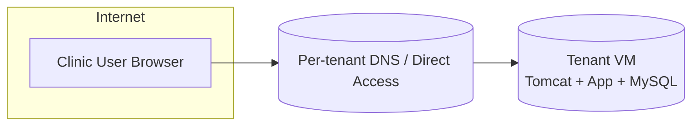
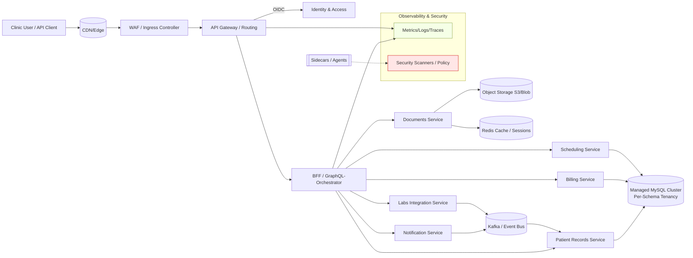
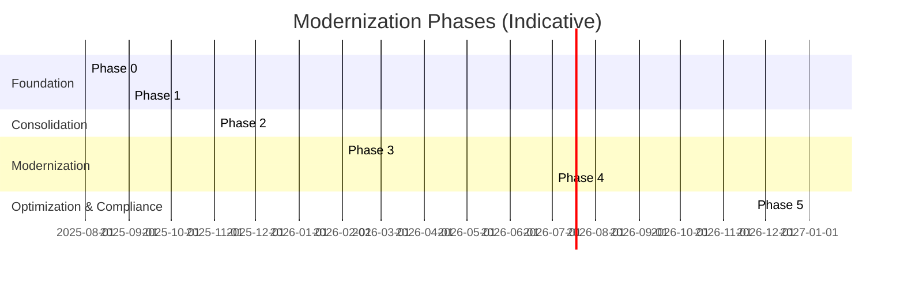
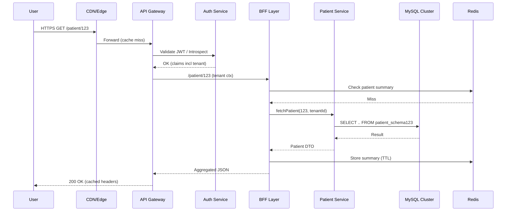
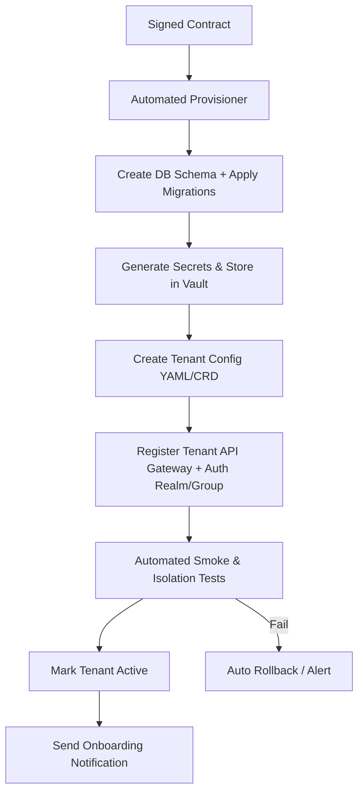
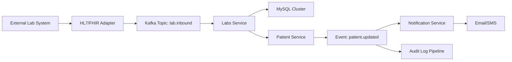

# Platform Modernization & Multi-Tenancy Roadmap

Version: 2025-08-10  
Owner: Elvis Addae
Status: Draft (Initial)

# Executive Summary (Non-Technical Overview)
We are transitioning from a costly, fragile "one customer = one server" model to a secure, pooled, modern cloud platform. This enables scaling from 100 to 2000+ clinics without a linear cost explosion, while improving security, reliability, speed of feature delivery, and compliance readiness. The change is incremental (no risky big-bang rewrite) and front‑loads risk reduction (security, operations) before deeper refactors. Net result after 18–24 months: 60–75% lower infrastructure cost per tenant, releases in hours (not weeks), 99.9%+ availability, and a security posture aligned with healthcare regulations.

Top 5 Business Outcomes:
1. Cost Efficiency: Pooling resources & automation drive major reduction in per-tenant infrastructure & support overhead.
2. Faster Time-to-Market: Modular architecture + CI/CD accelerates feature rollout → competitive differentiation & higher retention.
3. Security & Compliance: Modern frameworks, dependency hygiene, audit controls reduce breach & regulatory risk.
4. Reliability & Patient Safety: High availability & resilience patterns reduce downtime that affects clinical workflows.
5. Scalable Growth: Platform can absorb a 20× client increase without a 20× operations team.

Investment Snapshot:
- Phase 0–2 (first 6 months): Primarily platform engineering & security hardening (foundational, low user disruption).
- Phase 3–4 (months 6–15): Dual-run legacy + modern modules; visible UX improvements begin.
- Phase 5 (months 15–24): Optimization & advanced compliance automation.

ROI Drivers (Illustrative):
- Current VM model (estimate): 8 GB / 4 vCPU per tenant ~ (assume) $160–$220 monthly infra blended → 2000 tenants ≈ $3.8M–$5.3M/yr.
- Pooled cluster (post-optimization): ~0.35–0.4 GB avg RAM & fractional vCPU per tenant with autoscaling → projected $1.0M–$1.4M/yr.
- Net annual infrastructure savings: $2.5M–$3.9M (reinvest partly into product & security).
- Productivity gains (DORA improvements) reduce opportunity cost & accelerate revenue features.

Risk Mitigation Approach:
- Start by shielding & measuring (security layers, logging) before replacing internal components.
- Strangler pattern ensures rollback paths & limits blast radius.
- Feature flags & canary deploys reduce release risk.

KPIs Tracked Monthly for Exec Dashboard:
- Cost / Tenant, Deployment Frequency, Lead Time, Availability %, Security Vulnerabilities (open >30 days), p95 Latency, Tenant Onboarding Time.

---

## 1. Context & Drivers
Current deployment = 1 VM (Tomcat + MySQL) per tenant (8 GB RAM / 4 vCPU / 50 GB disk). 100 clients now; forecast 2000 in 24 months. Operating 2000 dedicated VMs is cost prohibitive, operationally risky, and slows dev velocity. Legacy tech stack (Struts 1.x, Spring 2.x/3.x, Hibernate 3, Axis2, assorted outdated libs) increases security exposure and inhibits rapid feature delivery.

Primary goals:
- Cost & operational scalability (multi-tenancy + pooled infrastructure)
- Strong security & compliance posture (healthcare data)
- High availability & resilience (SLO-driven)
- Developer productivity & delivery velocity
- Incremental evolution (avoid big-bang rewrite) while reducing legacy risk

## 2. Guiding Principles
1. Strangler pattern over rewrite; coexist legacy & modern modules.  
2. Security & tenancy isolation tests are blocking gates.  
3. Small, reversible increments (≤2 weeks) shipped continuously.  
4. Observability, automation, and compliance baked in from inception.  
5. Prefer managed/cloud-native services to reduce undifferentiated ops.  
6. Modular monolith first; extract services only for clear scaling/ownership wins.  

## 2a. Business Value & ROI Overview
| Value Pillar | Problem Today | Modernization Lever | Benefit Metric | Target (12–18 mo) |
|--------------|---------------|---------------------|----------------|------------------|
| Cost | 1:1 VM → linear cost | Multi-tenancy, autoscaling | Cost/tenant ↓ | -60% to -75% |
| Growth Capacity | Ops cannot handle 10× | Automation, orchestration | Tenants/Eng FTE ↑ | >150 per FTE |
| Security & Compliance | Legacy CVEs, weak central control | Updated stack, DevSecOps, IdP | Open critical vulns | 0 >30 days |
| Reliability | Single-instance fragility | HA cluster, resilience patterns | Availability | ≥99.9% |
| Delivery Speed | Slow releases | CI/CD, modular code | Lead time | <24h |
| Customer Retention | Performance issues, downtime risk | Performance tuning, SLOs | Churn rate ↓ | (Set baseline) |

Executive Narrative (Plain Language): We are turning a collection of individually managed servers into a single, smart, auto‑scaling platform. This reduces waste, makes updates safer, and strengthens defenses around sensitive health data. The plan balances quick protective wins with a measured transformation of the codebase.

## 3. Target Reference Architecture (Iterative End State)
- Frontend: SPA (React/Vue) + BFF (REST/GraphQL) gradually replacing JSP/Struts.
- Backend: Java 17+ Spring Boot 3 modular services (Auth, Billing, Patient Records, Scheduling, Documents, Labs Integration, Notifications).
- Tenancy: Shared app layer; per-tenant MySQL schema (phase 1) → optional shared schema with tenant_id & row-level security (phase 2, only if necessary).
- Data: Managed MySQL cluster (Aurora / equivalent) + read replicas for analytics; Redis for cache + sessions; Object storage (S3) for documents.
- Messaging/Eventing: Kafka (or cloud alternative) for integrations, audit, async workflows.
- Identity & Policy: External IdP (Keycloak/Auth0) OIDC + fine-grained authorization (OPA / policy engine) + audit trail.
- Ingress: API gateway / Ingress controller with WAF, rate limiting, TLS termination, security headers.
- Observability: OpenTelemetry (metrics, logs, traces) → Prometheus / Grafana / Loki / Tempo (or managed).  
- CI/CD: Trunk-based, pipeline enforcing SAST, SCA, secrets scan, tests, SBOM, deploy automation (ArgoCD / GitOps recommended).
- Security Controls: Vault-managed secrets, KMS encryption, CIS hardened base images, runtime policy (Falco / eBPF), container image signing (cosign).
- Resilience: Multi-AZ, HPA, circuit breakers (Resilience4j), feature flags, blue-green / canary deployments.

### 3a. Architecture Diagrams

#### 3a.1 Current State (One VM per Tenant)

#### 3a.2 Target State (Shared Multi-Tenant Platform)

#### 3a.3 Phased Implementation Layers

#### 3a.4 Request Flow (Example: Patient Dashboard Load)

#### 3a.5 Tenant Onboarding Workflow

#### 3a.6 Data Flow & Eventing (Simplified)

### 3b. Can We Deploy the Code “As-Is”? What Must Change and Why
**Short Answer:**  
- **True pooled multi-tenant deployment (Kubernetes + shared DB cluster): _No, not without changes_.** The current application assumes per-tenant server isolation and local state, which blocks horizontal scaling and safe tenancy isolation.  
- **Interim container-per-tenant lift-and-shift: _Mostly yes_, with targeted changes** (externalized config, health checks, Redis sessions). This enables early wins while refactoring for proper multi-tenancy.

#### Minimum-Change Lift-and-Shift (Phase 1–2)
- Containerize the WAR (multi-stage Docker build).  
- Externalize configuration to environment variables / ConfigMaps; move secrets to Vault.  
- Add `/health` and `/ready` endpoints for orchestrator readiness.  
- Redis-backed sessions to eliminate sticky session requirements.  
- Temporary persistent volume for unavoidable local writes, with planned migration to object storage.  
- Deploy in isolated namespaces or workloads per tenant initially, then consolidate after tenancy readiness.

#### Why “As-Is” Won’t Work for the Pooled End State
| Area | Current Likely Behavior | Why It Blocks Modern Ops | Required Change |
|------|------------------------|--------------------------|-----------------|
| Session Management | Tomcat in-memory sessions | Breaks stateless scaling & resilience | Redis sessions (P1), token-based auth (P3) |
| File Storage | Local disk for uploads/reports | Containers are ephemeral; no HA | Object storage (S3/Blob) (P2) |
| Config & Secrets | Properties files per VM | No automation; insecure | Env/config maps; Vault secrets (P1) |
| Health & Readiness | No endpoints | Cannot autoscale safely | `/health` & `/ready` checks (P1) |
| Background Jobs | Quartz/Cron in web app | Jobs restart/fail on pod reschedules | Dedicated workers or clustered jobs (P3) |
| Tenancy Resolution | DB-per-VM assumption | No tenant isolation in pooled app | Tenant context + datasource routing (P2) |
| AuthN/AuthZ | Legacy login/session | Weak central control; no MFA/SSO | OIDC integration; centralized policy (P3) |
| Libraries & Runtime | Outdated frameworks | Security & compatibility risk | CVE-free upgrades; Java 17 path (P3) |
| Logging & Tracing | Unstructured logs | No tenant-level observability | JSON logs; trace/tenant IDs; OpenTelemetry (P1) |
| Reporting | Heavy sync exports | Latency spikes & timeouts | Async processing via queue (P4) |

#### Early Proof Points
- **Phase 1:** Container image, config externalization, Redis sessions, health endpoints (pilot 5–10 tenants).  
- **Phase 2:** Per-schema tenancy, automated DB migrations, object storage for documents.  
- **Phase 3:** OIDC integration, façade module for new endpoints, move long-running jobs out of web tier.

## 4. Phased Roadmap (Quarters are illustrative)
### Phase 0 (Weeks 0–4) Immediate Triage
- Add SBOM (CycloneDX or Syft) + OWASP Dependency-Check / Snyk to build.  
- Reverse proxy (NGINX/Envoy) in front of tenant VMs: TLS, HSTS, CSP, rate limiting.  
- Central log aggregation (Fluent Bit → OpenSearch/ELK).  
- Secrets vault (HashiCorp Vault / cloud service); remove plain creds from properties.  
- Structured logging JSON + correlation IDs (tenant, request).  
- SECURITY.md & disclosure process.  
- Inventory & classify all third-party libs (risk register).  

### Phase 1 (Months 2–3) Containerization & Config Externalization
- Create Dockerfile (multi-stage) for legacy WAR (Java 8 baseline).  
- Externalize environment-specific settings via env vars / config map / secrets.  
- Add basic health/readiness endpoints (if absent) for orchestrator.  
- Introduce Redis (sessions) to eliminate Tomcat sticky need.  
- Pilot Kubernetes (or ECS) cluster with 5–10 tenants (mirror traffic for testing).  

### Phase 2 (Months 3–6) Multi-Tenant Consolidation
- Migrate all tenants from per-VM to pooled cluster (scalable replicas).  
- Consolidate MySQL: Per-tenant schema in managed DB cluster; automation for schema creation, migration, backup, PITR.  
- Autoscaling (HPA) + resource limits tuned from utilization metrics.  
- Implement per-tenant resource dashboards & isolation tests.  

### Phase 3 (Months 4–9) Modernization Foundations
- Begin Java 17 upgrade path (multi-module build, dual CI lane).  
- Introduce Spring Boot 3 façade module; proxy new REST endpoints to legacy internals.  
- Bounded context mapping & modular monolith refactor (Billing, Patient, Documents, Labs, Auth).  
- Replace / wrap Struts 1 actions gradually (new features only in Boot).  
- Replace Commons-DBCP → HikariCP; Joda-Time → java.time; outdated libs upgrade (log4j2 latest, commons-fileupload, jsch, Quartz 2.x).  
- Keycloak (OIDC) integration; central JWT issuance; deprecate custom auth.  
- Add OPA (or simple ABAC) for tenant/role/resource policies.  

### Phase 4 (Months 9–15) UI & Domain Decoupling
- New SPA for high-traffic modules (Patient dashboard, Scheduling).  
- Event bus (Kafka) for async document generation, lab ingestion, notifications.  
- Extract Auth + Document Generation + Notification as independent services (if bounded context stable).  
- Implement resilience patterns (circuit breakers, bulkheads, retries).  
- Enhanced audit trail (immutable, signed).  

### Phase 5 (Months 15–24) Scale, Optimization, Compliance
- Additional service extraction only where justified (Labs, Billing).  
- Performance tuning (DB indexing, caching layer for static code sets).  
- Active-Active multi-region optional (if latency / DR requirements).  
- Row-level tenancy refactor (optional) if schema-per-tenant becomes operationally heavy.  
- Compliance automation: Evidence collection, policy as code, continuous pen-test integration.  
- Supply chain hardening (Sigstore signing, SLSA level progression).  

## 5. Critical Legacy Risks & Mitigation
| Component | Current | Risk | Mitigation (Short Term) | Long Term |
|-----------|---------|------|-------------------------|-----------|
| Struts 1.2.7 | EOL | CVEs RCE | Shield w/ WAF & input validation | Replace with Spring Boot controllers |
| Spring 2.x/3.x | EOL | CVEs | Constrain attack surface | Migrate to Spring Boot 3 |
| Hibernate 3.4 | Old | Performance / security | Limit new usage | JPA/Hibernate 6 module |
| Axis2/CXF old | 1.5.4 / 2.7 | CVEs | Restrict endpoints & patch | Replace with REST/FHIR or updated SOAP only where mandated |
| Quartz 1.8.5 | Old | Missed bug fixes | Contain background jobs | Quartz 2.x or event-driven scheduling |
| Commons-FileUpload 1.3.3 | CVEs | Upload exploit | Validate, AV scan | Servlet 3 multipart or updated lib |
| jsch 0.1.49 | Older | Crypto issues | Limit usage | Upgrade or alternative library |
| Joda-Time 1.4 | Deprecated | API errors | Wrap usage | Migrate to java.time |

## 6. Tenancy Strategy
Phase 1: Per-schema tenancy: (db_{tenant_id}). Pros: Clear isolation, easy backup/restore, simpler migration. Cons: Schema count growth (indexes mgmt automation needed).
Phase 2 (optional): Shared schema w/ tenant_id, row-level security & partitioning. Only if operational/maintenance overhead of >2000 schemas becomes burden.
Automation required: Schema provisioner service, versioned migrations (Flyway/Liquibase) applied in parallel (or rolling) with success/failure reporting & rollback.

## 7. Data & Migration
- Inventory all schema differences across existing tenant DBs; standardize baseline before consolidation.  
- Dual-write tests (shadow) for new persistence module when upgrading ORM.  
- PITR & per-tenant logical backups; periodic restore drills (at least quarterly).  
- Large tables (documents, audit) → consider partitioning & low-cost storage tier (S3 + index metadata).  

## 8. Security & DevSecOps
Controls matrix (OWASP ASVS alignment) – maintain in separate spreadsheet / repo. Highlights:  
- Build-time: SBOM, SAST, SCA, secret scan, IaC scan.  
- Deploy-time: Image signing, admission controller (verify signature, block critical CVEs).  
- Runtime: WAF, RASP (optional), eBPF runtime anomaly detection, centralized IAM, least privilege service accounts, network policies (K8s).  
- Data: At-rest encryption (DB, object storage, backups), TLS in transit, key rotation schedule.  
- Auth: OIDC flows, MFA for staff; API tokens short-lived with refresh; service-to-service mTLS / SPIFFE (future).  
- Authorization: Policy engine evaluation per request; deny by default; audit decision.  
- Logging/Audit: Tamper evident, immutable store (append-only + hash chain).  
- Incident Response: Runbooks, on-call rotation, attack simulations (tabletop + red team light).  

## 9. Observability
- Metrics: p95 latency, error rate, saturation (CPU/mem), DB query latency, queue lag, per-tenant request volume.  
- Logs: Structured JSON; fields: timestamp, traceId, spanId, tenantId, userId, action, status, latencyMs.  
- Traces: Instrument high-value flows (login, patient lookup, lab ingest) first.  
- Alerts: SLO burn rates (fast/slow), anomaly detection for memory leaks, DB connection pool exhaustion.  

## 10. CI/CD Pipeline (Reference)
Stages:  
1. Compile + Unit Tests (mvn verify).  
2. SAST/SCA/Secrets (fail on critical).  
3. Build container + SBOM + sign image.  
4. Integration tests (ephemeral env w/ ephemeral schemas).  
5. Contract & isolation tests (enforce tenant boundaries).  
6. DAST + performance smoke.  
7. Canary deploy (progressive traffic) + automated rollback on error budget burn.  
8. Promote to production (GitOps merge).  

## 11. Bounded Contexts (Initial Draft)
- Auth & Identity
- Patient Records (core EMR)
- Scheduling & Appointments
- Billing & Claims
- Documents & Media (storage, generation, conversion)
- Labs & Integrations (HL7/FHIR ingest)
- Notifications (email/SMS/push)
- Reporting & Analytics

Maintain ADRs for any context split or service extraction.

## 12. KPIs & Metrics
| Category | Metric | Target (12–18 mo) |
|----------|--------|------------------|
| Delivery | Deployment frequency | Daily (weekdays) |
| Delivery | Lead time (commit→prod) | < 24h |
| Reliability | Availability | ≥ 99.9% |
| Reliability | MTTR | < 30 min |
| Quality | Change failure rate | < 10% |
| Security | Mean time to remediate high vuln | < 14 days |
| Cost | Avg cost per tenant (infra) | -70% vs current VM model |
| Performance | p95 core API latency | < 300 ms |

## 13. Risks & Mitigations
| Risk | Impact | Mitigation |
|------|--------|-----------|
| Parallel legacy & new stacks increase complexity | Medium | Strong observability, façade, clear deprecation roadmap |
| Migration fatigue / scope creep | High | Timeboxed increments, WIP limits, outcome metrics |
| Performance regressions post-migration | High | Automated performance smoke tests pre-release |
| Schema divergence during consolidation | Medium | Introduce migration gate (Flyway) before code merge |
| Security regression during refactor | High | Mandatory security tests; feature flags only after passing gates |

## 14. Immediate Backlog (Actionable Sprint Seeds)
1. Add SBOM + dependency scanning to existing Maven pipeline.  
2. Draft Dockerfile & container build step (Java 8 baseline).  
3. Implement reverse proxy layer with security headers & rate limiting.  
4. Centralize secrets (Vault) & remove plaintext from repo.  
5. Introduce structured logging pattern & correlation IDs.  
6. Produce bounded context diagram & ADR-0001 (Architecture vision).  
7. Create Spring Boot façade module (read-only patient endpoint) behind feature flag.  

## 15. Deliverables to Add (Recommended Files)
- `Dockerfile` (multi-stage)  
- `helm/` chart scaffold  
- `SECURITY.md`  
- `.github/dependabot.yml` or equivalent  
- `ADR/` folder with ADR-0001 through ADR-000x  
- `scripts/tenant_schema_migrate.sh` (automation)  
- `k8s/` manifests (base)  

## 16. Change Management & Governance
- Use PR template linking to risk assessment & threat model delta.  
- Maintain risk register in repo (YAML/Markdown).  
- Quarterly architecture review (retire legacy modules, update roadmap).  
- Annual external penetration test; internal threat modeling each major feature.  

## 17. Future Enhancements (Optional / Later)
- Row-level encryption of sensitive columns (PHI) with envelope keys.  
- SPIFFE/SPIRE for workload identity.  
- GraphQL BFF for aggregated patient views.  
- Multi-region active-active with global traffic management.  
- Chaos engineering program (resilience validation).  

## 18. Acceptance Criteria for "Modern Platform" Milestone
- ≥90% tenants on pooled cluster; legacy per-VM retired.  
- All critical legacy frameworks (Struts 1.x, Spring <5) removed from production code paths.  
- Java 17 baseline; build & runtime hardened containers signed & verified.  
- Automated CI/CD with security gates & canary deploys.  
- Observability SLOs defined & met for 3 consecutive months.  
- Documented multi-tenant isolation tests passing in pipeline.  
- Cost per tenant reduced ≥60% vs baseline.  
- No unpatched critical CVEs older than 30 days.  

## 19. Glossary
- ADR: Architecture Decision Record.  
- SLO: Service Level Objective.  
- SBOM: Software Bill of Materials.  
- WAF: Web Application Firewall.  
- OPA: Open Policy Agent.  
- PITR: Point In Time Recovery.  

## 20. Revision Log
| Date | Version | Author | Notes |
|------|---------|--------|-------|
| 2025-08-10 | 0.1 | (Add) | Initial draft committed |

## 21. Stakeholder Impact & Communication Plan
| Stakeholder Group | Impact | What Changes for Them | Communication Cadence | Key Message |
|-------------------|--------|-----------------------|-----------------------|-------------|
| Customers (Clinics) | Positive (performance, reliability) | Gradual UI upgrades; improved stability | Quarterly roadmap webinar + release notes | Better speed & reliability; no action required |
| Support / Customer Success | Tooling & processes evolve | Central dashboards, faster diagnostics | Bi-weekly enablement | Faster issue resolution & fewer tickets |
| Product Management | Faster iteration cycles | Smaller, more frequent launches | Sprint review & monthly KPI review | Ability to validate features sooner |
| Engineering | New platform & pipelines | Containers, IaC, observability standards | Weekly engineering sync | Automation reduces toil; standards protect quality |
| Security / Compliance | Increased visibility & control | SBOMs, audit trails, policy as code | Monthly risk review | Proactive posture & audit readiness |
| Executives | Improved financial leverage | FinOps & KPI dashboards | Monthly exec dashboard | Lower unit cost funds innovation |

## 22. Plain-Language Summary (For Non-Technical Readers)
We are upgrading from many separate “boxes” (servers) to a shared smart platform. This lets us serve many more clinics without multiplying cost or staff. We also tighten security and make it easier to release improvements quickly. The work happens in safe, small steps—first protecting what we have, then modernizing, then optimizing. Success means lower costs, faster innovation, stronger security, and happier customers.

## 23. Executive Q&A Cheat Sheet
| Question | Short Answer |
|----------|--------------|
| Why now? | Demand growth would explode cost & risk if we keep current model. |
| How do we avoid a risky rewrite? | We modernize piece by piece (strangler pattern) with rollback options. |
| When do customers see value? | Performance & stability in first 3–6 months; UI & feature velocity months 6–12. |
| Biggest early risk? | Parallel complexity—mitigated via observability & strict deprecation tracking. |
| Security improvements? | Central auth, dependency hygiene, signed builds, continuous scanning. |
| Cost savings source? | Resource pooling + autoscaling + reduced ops toil; not cutting quality. |
| Success definition? | See Acceptance Criteria—measurable KPIs met & legacy stack retired. |

---
Next step: Implement Immediate Backlog items; update status weekly.
